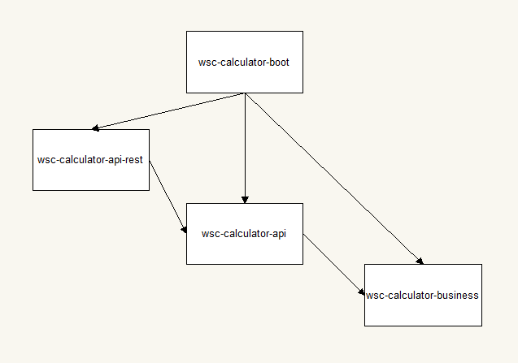

# wsc-Calculator
Calculator microservice for arithmetic operations

## Quickstart

Built with:

* Java 17
* Maven3
* Spring boot 3

### Compile
On the root of the project, run the command:
```
mvn clean install --file code/
```
### Run

Once the project is compiled, run the command:

```
java -jar code/wsc-calculator.jar 
```

# Design overview
## Module architecture diagram


* **wsc-calculator-boot**: module with the `main` and all the configuration files and classes
* **wsc-calculator-api-rest**: module with the classes related to the rest implementation of the service
* **wsc-calculator-api**: module with the exposed services decoupled from the implementation. Several modules, each with its own implementation could consume it.
* **wsc-calculator-business**: module with the business logic.

## Design choices
* The 'operate' endpoint receives the operator and a list of operands. Initially limited to 2, but could in the future receive more operands if needed without breaking the api.
* The use of the strategy pattern on the business layer allows to add more implementations for new operations without the need of big modifications

## Dependencies
* **httpclient5**: apache library for http client functionalities required for the generated code for the api
* **jackson-databind-nullable**: wrapper that allows the distinction between null and "null" on the rest implementation
* **lombok**: library that provides annotations to reduce boilerplate code
* **mapstructs**: library that provides simple mappings between two classes. Useful when converting elements from one layer to another
* **maven-jar-plugin**: added to override the location of the built jar for convenience
* **openapi-generator-maven-plugin**: Plugin chosen to create the rest api code from the OpenApi specification
* **spring-boot-devtools**: Spring devtools to speed up development
* **spring-boot-starter-test**: Spring starter for testing
* **spring-boot-starter-validation**: Spring starter for validations used on the controller layer
* **spring-boot-starter-web**: Spring starter for web applications

# Functional documentation
Swagger Url http://localhost:8080/calculator/api/v1/swagger-ui/index.html

## Operate endpoint:

**/calculator/api/v1/operate:**
Example:
```
curl -X POST http://localhost:8080/calculator/api/v1/operate -H "accept: application/json" -H "Content-Type: application/json"  -d "{""operator"": ""sum"", ""operands"": [10.21, 55.4 ]}"
```

The "operator" field can be "sum" or "subtract", depending on the desired operation.
The "operands" field must be a list of two elements.

 